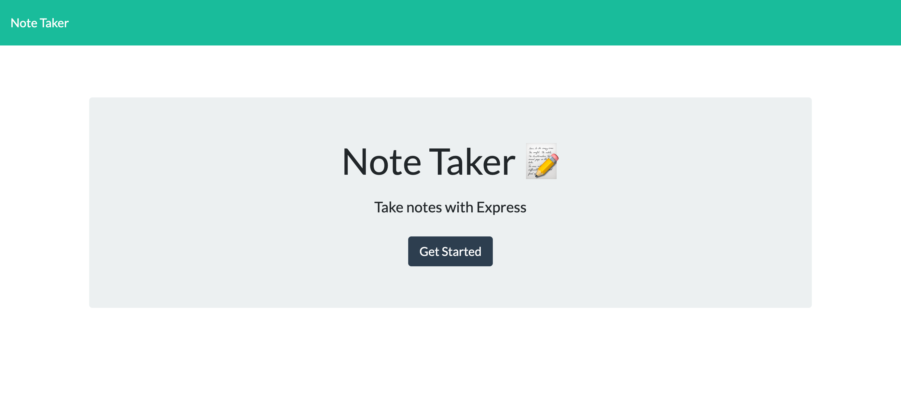
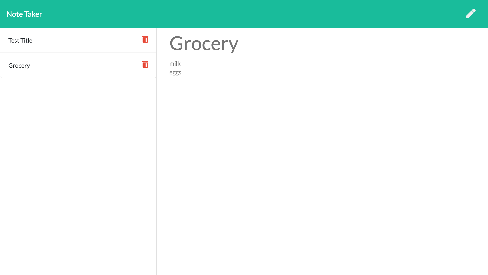

# Note-Taker

## Description

A notes application deployed on Heroku. This application allows the user to write, save, and delete notes so that they can organize their thoughts and keep track of tasks to be completed. This application will use an express backend and save and retrieve note data from a JSON file.

## Table of Contents  
* [Screenshots](#screenshots)
* [Contributing](#contributing)
* [Questions](#questions)
* [Links](#links) 

## Screenshots

## Contributing
To contribute to this project you can fork this GitHub repository.

## Questions
If you have any additional questions about this application you can reach out to me at briannahebeler@gmail.com.
You can check out some of my other projects at briannahebeler (https://github.com/briannahebeler).

## Links

* Deployed Application: https://notetaker-briheb.herokuapp.com/ 

* GitHub Repo: https://github.com/briannahebeler/Note-Taker
